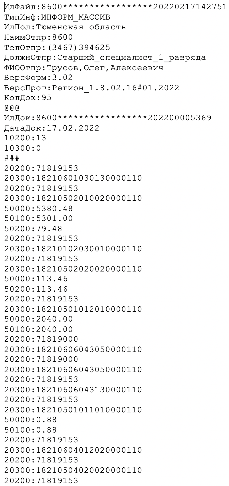
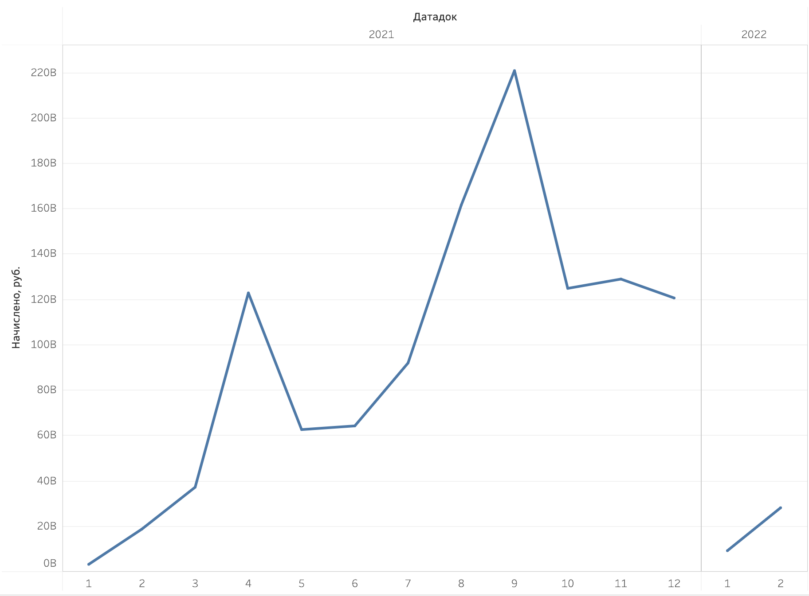

# Parcing raw text data from The Federal Tax Service (ФНС)

There was a task to prepare a raw text data to the structured data format.

Here is a part of that raw data:

The task is to convert it into readable .csv format. 
When we reach '@@@' it means that info-block has started.
Info-block contains Document ID (ИдДок), Date of document (ДатаДок) and '10100:' that means All-Russian classifier of types of economic activity (ОКВЭД). If ОКВЭД is not presented, set its value to zero.

When we reach '###' it means that value-block has started.

Value-block contains following codes:

* 20200 means All-Russian classifier of events of municipalities (ОКТМО)

* 20300 means budget classification code (КБК)

* 30100 means all taxes accrued

* 30200 means all taxes recieved

* 30300 means compensated

* 40100 means total debt

* 50000 means overpayment

For every different ОКТМО and every different КБК it's needed to count values of all of the above codes.

Then we can use this .csv file in BI instruments to visualize these values.

E.g., here is a plot of how much taxes were accrued by every month.

